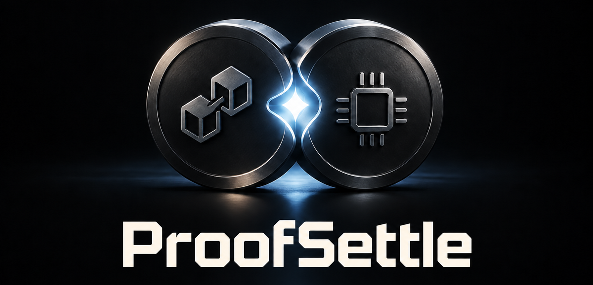
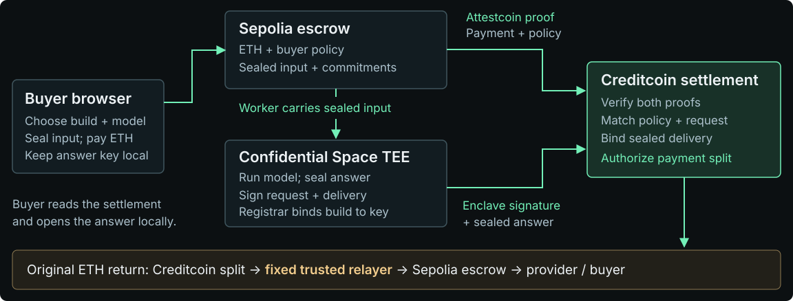

# ProofSettle

**An oracle proves a fact. ProofSettle enforces a policy.** Attestcoin proves the Sepolia payment and the buyer’s requirements inside it. Creditcoin enforces those requirements against a second cryptographic system: a measured enclave’s signature over the exact request and sealed answer. Both must agree before settlement.

[Start a private compute job](https://proofsettle.pages.dev/desk.html) · [Evidence for judges](https://proofsettle.pages.dev/evidence.html) · [Deck](https://proofsettle.pages.dev/ProofSettle-deck.pdf)

Built by **Robert Moore**, solo, for Creditcoin BUIDL 2026 Fall. Public testnet implementation, MIT licensed.

## Use it as a buyer

1. Open [ProofSettle](https://proofsettle.pages.dev/) and choose **Start a private compute job**. Use a normal browser profile with MetaMask on Sepolia and test ETH for a 0.001 ETH order plus gas.
2. **Prepare the order.** Choose a synthetic applicant and the build you will accept. The browser checks the published confidential workload’s enrollment evidence before enabling payment.
3. **Seal and pay.** Review the service, input, build and price, then approve the actual wallet transaction. The encrypted record and your requirements travel inside your Sepolia payment. The answer key stays in this browser profile.
4. **Track your own delivery.** Stay on the order page. It follows the source payment, Attestcoin attestation, Creditcoin settlement, locally decrypted answer and original ETH withdrawal. Testnet attestation takes several minutes; an existing order can be resumed from its URL without paying again.
5. **Test the buyer’s requirement.** After a successful purchase, choose **Test a different build** to place a second real order that the live enclave cannot satisfy. Creditcoin should refuse it with `EnclaveNotAccepted`. The test payment remains in escrow until the **30-day timeout refund**; this is not an immediate refund demonstration.

A funded order protects the provider from an unfunded promise. Binding the request and delivered ciphertext protects the buyer from paying for a substituted request or a missing answer. A computed `decline` still pays for successful service: applicant approval is separate from compute completion. Original ETH return uses a **fixed trusted relayer**, described below.

**For judges:** [supporting evidence](https://proofsettle.pages.dev/evidence.html) contains a completed reference run, a deliberately public synthetic answer, independent readbacks and enrollment verification. These are an appendix to the product workflow. The reference answer publishes a disposable key; it is not presented as the result of your new purchase.

The [evidence manifest](site/demo.json) and [deployment addresses](site/deployments.json) identify the public reference records. The browser checks public chain data locally. Fresh refusals can be found directly in Creditcoin blocks when the explorer index lags. Verification does not create a new payment or run the model again.

## The customer and the product

A small lender needs a model's decision but cannot disclose the applicant's record to an unknown compute provider. ProofSettle seals that record to a measured workload and makes payment conditional on verifiable service completion.

The demo uses eight synthetic financial-behaviour features and a small deterministic logistic model. It isolates settlement correctness and requires no GPU. The longer-term use case is externally supplied private computation where the buyer needs both payment and execution guarantees. See [the model card](MODEL_CARD.md).

Applicant decisions are private model outputs; `Accepted`, `Rejected` and `Partial` in the contract describe the **compute service**, not applicant eligibility.

## Architecture



**Two proofs meet at Creditcoin.** The worker submits the payment proof and enclave signature together; the contract enforces the buyer’s policy and the exact sealed delivery. The buyer opens the answer locally. The separate ETH return step uses a fixed trusted relayer.

## How the protocol works

1. **Seal and pay on Sepolia.** The browser randomizes the input commitment with a fresh nonce, encrypts the record using X25519 + HKDF-SHA256 + AES-256-GCM, and appends the envelope to `createJob`. The escrow emits payer, provider, amount, required image measurement, model hash, input hash, envelope hash and a one-day settlement deadline.
2. **Prove the source event.** The worker constructs a proof with `RawProofBuilder` from source receipts and headers. It waits for Creditcoin's attested source height. A hosted builder is an optional fallback; neither builder is an authority.
3. **Run inside the measured enclave.** The enclave checks model and plaintext commitments, executes the model, encrypts the accepted answer to the buyer's return key and signs the request and exact delivery commitments.
4. **Check both proofs in one Creditcoin transaction.** The settlement contract verifies inclusion and continuity, pins the escrow emitter, reads the buyer's policy, checks the deadline, matches both commitments and recovers the registered enclave signer. Replay protection and every failure roll back atomically.
5. **Release the original payment.** A **fixed, explicitly trusted return relayer** reads the Creditcoin split after a 30-second confirmation lag and finalizes the Sepolia escrow. Permissionless `withdrawFor` can then send ETH only to the recorded recipients. This is not production Attestcoin writability.

### What Attestcoin contributes

`ComputeSettlement` extends [`AttestcoinProven`](src/AttestcoinProven.sol):

- The native verifier at `0x0000000000000000000000000000000000000FD2` supplies `calculateTxIndex` for the replay key and `verifyAndEmit` for inclusion and continuity. Returning `false` is a failure, as is reverting.
- `EvmV1Decoder` decodes the proven EVM transaction receipt. The contract requires successful source execution, identifies `JobCreated` by its exact signature, and rejects every emitter except its immutable source escrow.
- The proof carries **policy**: the required build and request commitments come from the buyer's payment. The settlement has no independent admin-editable buyer-policy allowlist. The enclave registry still has a trusted registrar.
- ChainInfo at `0x0000000000000000000000000000000000000FD3` supplies attested source height. Source chain key is pinned to `1` for Sepolia.

### Exact request and delivery binding (v2)

```text
requestHash = keccak256(abi.encode(modelHash, inputHash, envelopeHash))
deliveryHash = keccak256(actual delivery bytes appended to settlement)

signed digest = keccak256(abi.encode(
  "proofsettle.result.v2", destinationChainId, settlementAddress,
  jobId, resultHash, serviceOutcome, scoreBps, requestHash, deliveryHash
))
```

The return key is inside the encrypted envelope. Swapping it changes `envelopeHash` and therefore `requestHash`. A real enclave signature over a substitute request cannot settle the original payment. Omitting or replacing the signed answer payload fails `DeliveryMismatch`.

The trailer is `payload || uint32_be(length) || "PSE1"`. Source and destination contracts hash the actual trailer payload. The normal Solidity arguments still decode. The accepted response is encrypted; rejected requests carry a public, non-sensitive error reason.

## What this leaves behind for other Attestcoin builders

- [AttestcoinProven](src/AttestcoinProven.sol) consumes each proof once and treats a false verifier return as failure. [ComputeSettlement](src/ComputeSettlement.sol) shows the receipt-status and pinned-emitter checks, backed by tests and mutations.
- [PatientBlockProvider](worker/block-provider.ts) lets `RawProofBuilder` work on nodes without `eth_getBlockReceipts`. A [live comparison](worker/test/raw-proof.live.mjs) checks its proof byte for byte against the hosted builder.
- [The calldata rider](enclave/envelope.mjs) carries encrypted or plain payloads alongside ordinary Solidity calls without changing their ABI arguments. Consumers can bind the actual payload bytes, as the v2 contracts do.
- [The verifier measurement tool](script/measure.ts) scans CC3 events without sampling and explicitly reports any unread blocks, so other builders can rerun the measurement and assess its coverage.

The [10 September snapshot](site/measurement.json) covered 100,000 blocks with no unread blocks: 284 transaction destination contracts and 38,982 transactions carrying verifier events, compared with 142 and 10,035 in the 23 August scan. These measurements informed the local proof-builder fallback and a [published Hello Bridge tutorial correction](https://github.com/iamrobertmoore/attestcoin-protocol-examples/commit/378492809bc492a1653fe2f4f12194f8e93e4ced) on testnet fee budgeting.

## Trust and limits

This public testnet prototype has not undergone an independent security audit. Production readiness requires the review and recovery work below.

| Component | What is trusted or established |
|---|---|
| Attestcoin / Creditcoin | Native source-proof verification, chain consensus and finality assumptions |
| Google + confidential hardware | Enrollment evidence for the image and both enclave keys; not continuous runtime monitoring |
| Registry registrar | Verifies enrollment and binds/revokes the measurement-to-signing-key record |
| Proof worker | Cannot forge the source proof or enclave signature; can delay or withhold submission |
| Return relayer | **Trusted by Sepolia to report the correct Creditcoin split.** Its fixed key can misallocate escrow if compromised |
| Browser | Holds the plaintext and answer key; the web origin, device and wallet must be trusted |
| Model | Fixed published demonstrator; no fairness, predictive-quality or real-world underwriting validation |

Public chains contain **addresses, amounts, commitments and ciphertext**, not only hashes. The input hash is randomized by a nonce inside the encrypted record to discourage dictionary attacks on low-entropy synthetic features. Length and timing metadata are visible.

The source contract allows settlement within one day and a payer timeout refund after 30 days. Finalized and refunded states are mutually exclusive. If the relayer never finalizes, the buyer can eventually refund; the provider bears that return-leg availability risk. The confirmation lag is an operational precaution, not a consensus proof.

`ComputeCredit` retains its contract name for continuity but issues **PSR non-transferable historical receipts**. They are not redeemable money, transferable claims or independent evidence of ETH withdrawal.

Enrollment is permanent per image measurement in this prototype. Restarting the same image with a new ephemeral key requires a new registry/release strategy. Production work includes key rotation, recovery, independent security review and a verified return path. See [SECURITY.md](SECURITY.md).

Build 1.2.0 was [permanently revoked](https://creditcoin-testnet.blockscout.com/tx/0xe72c5338c76caa655037f3bc66fe656f495e49ea30f7bb8f0dfd88913d90ddd5) on 13 September. Its original key is inactive; build 2.0.0 remains active. The [release record](site/releases/v1/revocation.json) pins the transaction, registry and evidence hash.

The retired 1.2.0 enrollment token is [archived with its release](site/releases/v1/attestation.jwt). Its exact bytes match the old registry evidence hash. The old mutable URI now serves the current token; use this archive to audit that historical record.

## Verify locally

Requirements: Node.js 22+, Yarn 1.x, Foundry 1.2.3, Python 3, and Chromium for the browser suites. No wallet key is needed for verification.

```sh
git clone https://github.com/iamrobertmoore/proofsettle.git
cd proofsettle
yarn install --frozen-lockfile
forge install foundry-rs/forge-std --no-git
npx playwright install chromium
npm run judge:verify
```

On Linux, use `npx playwright install --with-deps chromium` if system libraries are missing. `yarn install` also installs the enclave's separately pinned cryptography dependencies. `PW_CHROMIUM` can select an existing browser binary.

The verification command runs contract tests, mutation checks, enclave/worker tests, deployment-decision tests, browser suites, Google-token verification and live Creditcoin readbacks. It reports skipped browser checks explicitly if Chromium is absent. **CI installs Chromium and requires all browser suites.** Network outages can fail the live-readback stages without invalidating local test results.

Focused commands:

```sh
forge test
./script/mutation-check.sh
npm run test:enclave
npm run test:worker
npm run test:site
node enclave/verify-crypto.mjs
node enclave/verify-token.mjs enclave/attestation.jwt
```

### What the tests establish

**65 contract tests and 15 killed security mutations.** The suite deliberately breaks emitter pinning, registry checks, revocation, replay protection, false-return handling, source status, signature malleability, source-chain pinning, service splitting, outcome binding, conservation, request binding, delivery binding, deadlines and double-refund protection. Every mutation must fail its defending test.

Ten enclave integration tests run the real server outside confidential hardware and check identity, model determinism, encrypted round trips, refusal cases and request/delivery signature binding. Three calldata tests use compiled ABIs. Browser tests use explicit RPC/wallet fixtures and the real enclave process; they are not themselves testnet evidence. The separate live manifest and readbacks supply that evidence.

## Repository map

| Location | Purpose |
|---|---|
| [`src/`](src/) | Source escrow, native proof adapter, policy enforcement, registry and receipt accounting |
| [`enclave/`](enclave/) | Measured Node workload, pinned standard signing/hash libraries, encryption and model |
| [`worker/`](worker/) | Raw proof construction, durable pending-job queue, enclave client and trusted return leg |
| [`site/`](site/) | Overview, live walkthrough, buyer desk, verifier, evidence and ABIs |
| [`deck/`](deck/) | Editable HTML deck and PDF at the stable public filename |
| [`test/`](test/) | Solidity tests and real-server signature fixtures |
| [`DEPLOY.md`](DEPLOY.md) | Deployment, enrollment, service operation and site publishing |
| [`site/releases/v1/`](site/releases/v1/) | Superseded deployment identities; current examples use v2 |

## Next: validate a narrow pilot

The first target is one lender and one model provider, using synthetic data. The next milestone is customer interviews and a design partner. Measure successful delivery rate, proof latency, total cost and recovery behaviour. Validate a per-settlement service/integration fee before choosing pricing. Independent review and lifecycle/recovery work precede real borrower data or a production deployment.

The deployed protocol and reproducible evidence provide a concrete starting point for that pilot.
